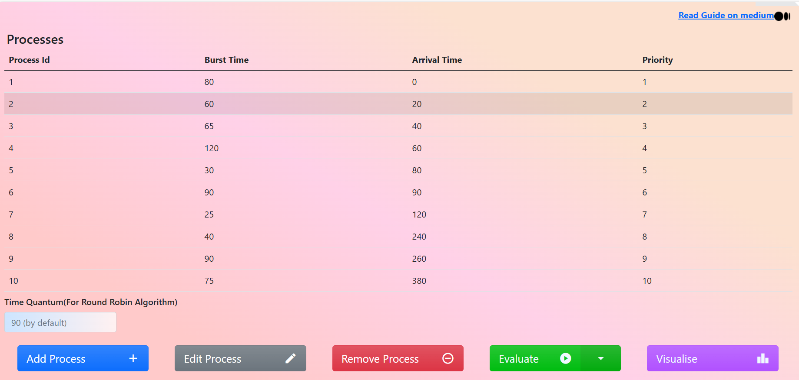
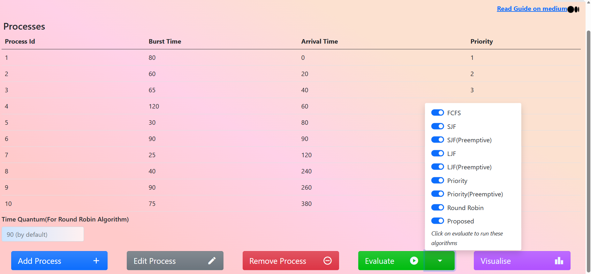
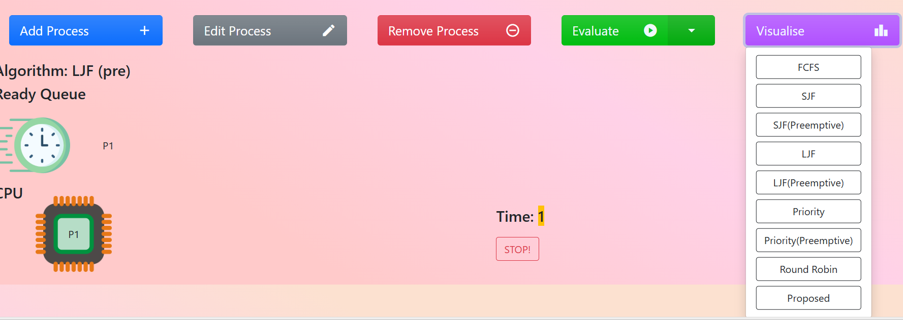
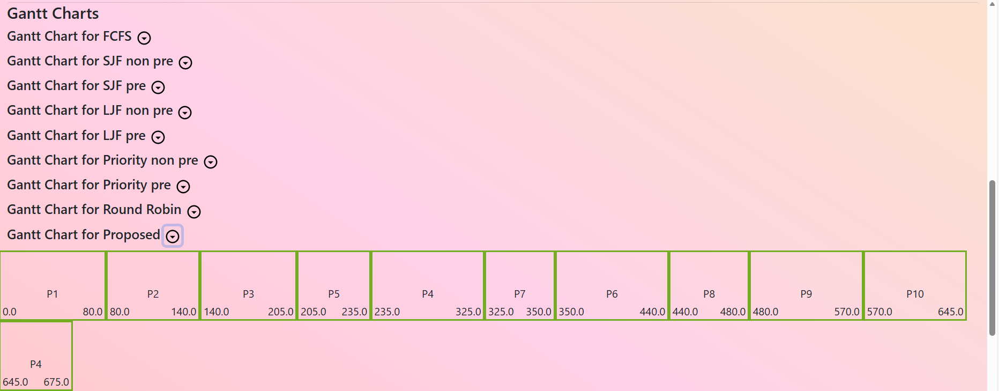
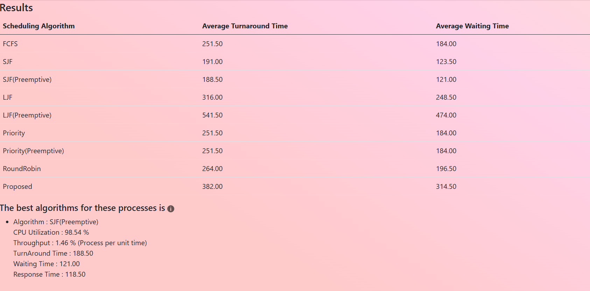

<h1>CPU Scheduling Algorithm Visualizer</h1>
<h2>Team Project</h2>

This project was developed as a <b>team project by a group of 4 members</b>.
Each member contributed to different aspects of the system, including
algorithm implementation, UI design, visualization, and testing.

<ul>
  <li>CPU Scheduling Algorithm Implementation</li>
  <li>User Interface Design and Responsiveness</li>
  <li>Gantt Chart Visualization</li>
  <li>Performance Metrics Evaluation</li>
</ul>

Working as a team helped strengthen collaboration, problem-solving skills,
and provided experience with real-world software development practices.

An interactive, responsive <b>web-based CPU Scheduling Algorithm Visualizer</b> built using
<b>HTML, CSS, and JavaScript</b>.

This project simulates, visualizes, and compares <b>9 CPU scheduling algorithms</b> using
real-time execution, Gantt charts, and standard Operating Systems performance metrics.

<h2>Why This Project?</h2>

CPU scheduling is a <b>core Operating Systems concept</b>.
Instead of explaining algorithms only theoretically, this project:

<ul>
  <li>Visually demonstrates how scheduling algorithms work</li>
  <li>Allows dynamic creation and modification of processes</li>
  <li>Compares algorithms using real OS performance metrics</li>
  <li>Helps understand fairness, starvation, and CPU utilization</li>
</ul>

<h2>Scheduling Algorithms Implemented</h2>

The following <b>9 CPU scheduling algorithms</b> are implemented:

<ol>
  <li>First Come First Serve (FCFS)</li>
  <li>Shortest Job First (Non-Preemptive)</li>
  <li>Shortest Job First (Preemptive)</li>
  <li>Longest Job First (Non-Preemptive)</li>
  <li>Longest Job First (Preemptive)</li>
  <li>Priority Scheduling (Non-Preemptive)</li>
  <li>Priority Scheduling (Preemptive)</li>
  <li>Round Robin</li>
  <li><b>Proposed Scheduling Algorithm</b></li>
</ol>

<h2>Proposed Scheduling Algorithm </h2>

The <b>Proposed Scheduling Algorithm</b> is a hybrid approach that combines:

<ul>
  <li><b>Round Robin</b> – ensures fairness</li>
  <li><b>Priority Scheduling</b> – supports importance-based execution</li>
  <li><b>Burst Time Ranking</b> – improves scheduling efficiency</li>
</ul>

<b>Key Ideas:</b>

<ul>
  <li>Dynamic time quantum calculation</li>
  <li>Intelligent process ranking</li>
  <li>Reduced starvation</li>
  <li>Improved response time</li>
  <li>Better CPU utilization</li>
</ul>

<h2>Application Walkthrough</h2>

<h3>Process Input Interface</h3>

Users can dynamically add, edit, or remove processes.
Each process includes the following attributes:

<ul>
  <li>Process ID</li>
  <li>Burst Time</li>
  <li>Arrival Time</li>
  <li>Priority</li>
</ul>

  

<h3>Algorithm Selection Panel</h3>

Multiple scheduling algorithms can be selected simultaneously for comparative analysis.

  

<h3>Evaluation & Visualization</h3>

The simulator evaluates selected algorithms, visualizes CPU execution,
displays ready and waiting queues, and computes performance metrics.

  

<h3>Gantt Chart Visualization</h3>

After evaluation, the simulator generates <b>Gantt Charts</b> for each scheduling algorithm.
These charts visually represent the execution order of processes along a timeline,
helping to understand CPU allocation and context switching behavior.

  

Each algorithm (FCFS, SJF, LJF, Priority, Round Robin, and the Proposed Algorithm)
has its own Gantt Chart for clear visual comparison.

<h2>Performance Metrics Evaluated</h2>

<ul>
  <li>Average Waiting Time</li>
  <li>Average Turnaround Time</li>
  <li>Average Response Time</li>
  <li>CPU Utilization</li>
  <li>Throughput</li>
  <li>Context Switching Count</li>
</ul>

  

The system automatically identifies the <b>best-performing algorithm</b>
for a given set of processes.

<h2>Features Summary</h2>

<ul>
  <li>Dynamic process management (Add / Edit / Remove)</li>
  <li>Multiple algorithm selection</li>
  <li>Step-by-step execution visualization</li>
  <li>Real-time clock tracking</li>
  <li>Detailed Gantt chart generation</li>
  <li>Automatic best-algorithm detection</li>
</ul>

<h2>Technologies Used</h2>

<ul>
  <li><b>HTML5</b> – application structure</li>
  <li><b>CSS3</b> – layout and visual styling</li>
  <li><b>JavaScript (ES6)</b> – scheduling logic and computation</li>
  <li><b>Bootstrap 5</b> – responsive user interface</li>
  <li><b>jQuery</b> – DOM manipulation</li>
  <li><b>Material Icons</b> – UI icons</li>
</ul>

<h2>How to Run</h2>

<ol>
  <li>Clone the repository</li>
  <li>Open <code>index.html</code> in any modern web browser</li>
  <li>Add processes, select algorithms, and click <b>Evaluate</b></li>
</ol>

